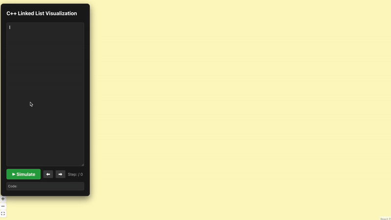

# C++ Linked List Memory Visualizer

A full-stack educational tool that parses C++ code to visualize a singly-linked list: illustrates pointer manipulation, list traversal, and memory leaks, and highlights the distinction between the **Stack** (pointers) and the **Heap** (nodes).

This project contains a **custom-built Python interpreter** designed to simulate how a C-style compiler manages memory in real-time.



### Key Technical Features
* **Code Parsing & Tokenization:** Uses Regex-based pattern matching in Python to interpret C++ syntax, including `new Node()`, pointer reassignment, and `while` loops.
* **Virtual Memory Management:** Tracks a simulated **Stack** (local variables) and **Heap** (dynamic memory addresses like `0x1`, `0x2`) to show exactly how memory is allocated.
* **Step-Through Debugging:** Generates a "Trace Log" of the entire execution, allowing users to move **forward and backward** through their code's execution timeline.
* **Scope & Function Handling:** Supports function calls and reference parameters (`Node* &head`), simulating scope pushes and pops to clear local stack variables.

---

## Architecture

| Component | Responsibility |
| :--- | :--- |
| **Frontend (React)** | Code editor interface, SVG-based node rendering, and state playback controls. |
| **Backend (Flask)** | Receives C++ strings, executes the simulation logic, and returns a JSON "snapshot" of memory for every line. |
| **Visualization** | Dynamic arrow (pointer) generation to represent `next` links in the heap. |


---

## The Inspiration
As an instructor, I found that the most effective way to teach linked lists was drawing them on a whiteboard. However, this process is:
1. **Tedious:** Redrawing the entire list for every pointer change is slow and repetitive.
2. **Error-Prone:** A small mistake can lead to student confusion.
3. **Static:** Students can't "rewind" a whiteboard drawing to see what happened three steps ago.

I built this tool to automate the "whiteboard experience", giving students a dynamic representation of how C++ code manipulates memory.


---

## Supported C++ Syntax
The backend simulator currently supports:
* **Allocation:** `Node* p = new Node(10);`
* **Traversal:** `curr = curr->next;`
* **Link Updates:** `head->next->next = newNode;`
* **Loops:** `while(curr != nullptr) { ... }`
* **Functions:** Custom function definitions with pointer-reference support.

---

## Getting Started

### Prerequisites
* **Python 3.x**
* **Node.js & npm**

### 1. Clone the Repo
```bash
git clone https://github.com/shannonlee0/linked-list-visualizer.git
cd linked-list-visualizer
```

### 2. Run the Backend (Flask)
#### It is recommended to use a virtual environment
```bash
python3 -m venv venv
source venv/bin/activate  # On Windows: venv\Scripts\activate
pip install flask flask-cors
python server.py
```
The server will start on http://localhost:5001

### 3. Run the Frontend (React/Vite)
```bash
npm install
npm run dev
```
Open the provided local URL in your browser.

## Simulation Examples

Try these scenarios to see the memory visualization in action:

### 1. Tracing Pointers by Reference (step-by-step solution to [CS106B Practice Problem #2](https://web.stanford.edu/class/archive/cs/cs106b/cs106b.1262/sections/section7/)
This script demonstrates how local copies of pointers behave differently than references. Watch the **Stack** carefully to see when a new local pointer is created versus when the original is modified.

<details>
<summary>Click to see C++ Code</summary>

```cpp
void confuse(Node* list) {
    list->data = 137;
}

void befuddle(Node* list) {
    list = new Node(0);
    list->data = 42;
    list->next = nullptr;
}

void confound(Node* list) {
    list->next = new Node(0);
    list->next->data = 2718;
}

void bamboozle(Node*& list) {
    list->data = 42;
}

void mystify(Node*& list) {
    list = new Node(0);
    list->data = 161;
    list->next = nullptr;
}

// MAIN
// 1. Setup the list 1 -> 3 -> 5
Node* list = new Node(1);
list->next = new Node(3);
list->next->next = new Node(5);

// 2. Run the trace functions
confuse(list);
befuddle(list);
confound(list);
bamboozle(list);
mystify(list);
```
</details>

### 2. Deleting a Node

<details>
<summary>Click to see C++ Code</summary>
  
```cpp
void confuse(Node* list) {
    list->data = 137;
}

void befuddle(Node* list) {
    list = new Node(0);
    list->data = 42;
    list->next = nullptr;
}

void confound(Node* list) {
    list->next = new Node(0);
    list->next->data = 2718;
}

void bamboozle(Node*& list) {
    list->data = 42;
}

void mystify(Node*& list) {
    list = new Node(0);
    list->data = 161;
    list->next = nullptr;
}

// MAIN
// 1. Setup the list 1 -> 3 -> 5
Node* list = new Node(1);
list->next = new Node(3);
list->next->next = new Node(5);

// 2. Run the trace functions
confuse(list);
befuddle(list);
confound(list);
bamboozle(list);
mystify(list);
```
</details>

### 3. Traversing a Linked List

<details>
<summary>Click to see C++ Code</summary>
  
```cpp
Node* head = new Node(4);
head->next = new Node(6);
head->next->next = new Node(9);

Node* curr = head;

while (curr != nullptr) {
    curr->data = 0;
    curr = curr->next;
}
```
</details>
